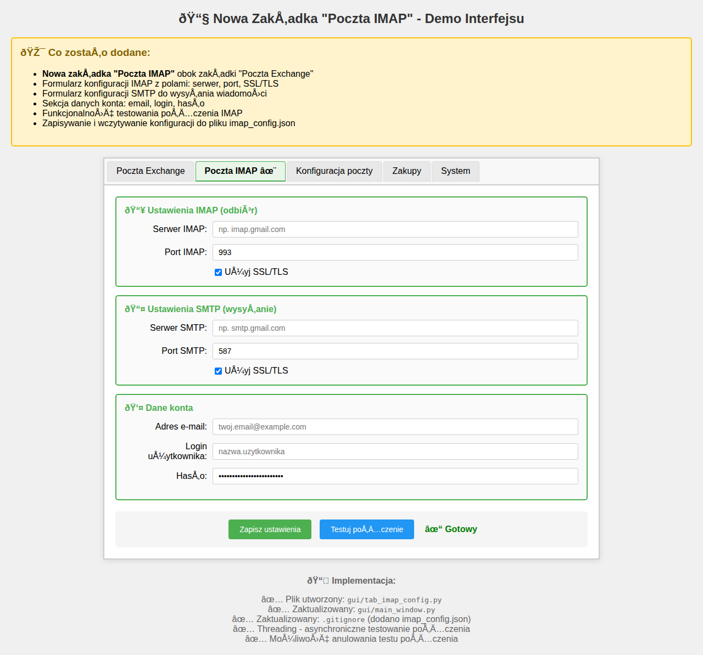

# Implementacja Zakładki "Poczta IMAP"

## Podsumowanie

Dodano nową zakładkę "Poczta IMAP" w głównym oknie aplikacji, umieszczoną obok istniejącej zakładki "Poczta Exchange". Zakładka umożliwia konfigurację połączeń IMAP/SMTP dla kont pocztowych innych niż Exchange.

## Zmiany w Kodzie

### 1. Nowy Plik: `gui/tab_imap_config.py`

Utworzono nowy moduł zawierający klasę `ImapConfigTab`, który jest analogiczny do istniejącego `tab_exchange_config.py` dla Exchange.

**Główne funkcjonalności:**
- Formularz konfiguracji IMAP z polami:
  - Serwer IMAP
  - Port IMAP (domyślnie 993)
  - Checkbox SSL/TLS
- Formularz konfiguracji SMTP z polami:
  - Serwer SMTP
  - Port SMTP (domyślnie 587)
  - Checkbox SSL/TLS
- Sekcja danych konta:
  - Adres e-mail
  - Login użytkownika
  - Hasło (zasłonięte)
- Przyciski akcji:
  - "Zapisz ustawienia" - zapisuje konfigurację do `imap_config.json`
  - "Testuj połączenie" - testuje połączenie IMAP w tle
- **Threading Support:**
  - Asynchroniczne testowanie połączenia (nie blokuje GUI)
  - Możliwość anulowania testu
  - Queue-based communication między wątkami
- **Persistence:**
  - Automatyczne wczytywanie konfiguracji przy starcie
  - Zapisywanie do pliku JSON

### 2. Zaktualizowany Plik: `gui/main_window.py`

**Dodano import:**
```python
from gui.tab_imap_config import ImapConfigTab
```

**Dodano nową zakładkę w Notebook:**
```python
# Zakładka: Poczta IMAP
logger.log("Ładowanie zakładki: Poczta IMAP")
imap_config_tab = ImapConfigTab(notebook)
notebook.add(imap_config_tab, text="Poczta IMAP")
logger.log("Zakładka 'Poczta IMAP' załadowana")
```

Zakładka została umieszczona między "Poczta Exchange" a "Konfiguracja poczty".

### 3. Zaktualizowany Plik: `.gitignore`

Dodano nowy plik konfiguracyjny do listy ignorowanych plików (zawiera wrażliwe dane):
```
imap_config.json
```

Dodano również ignorowanie plików demo HTML:
```
*_demo.html
```

## Struktura Pliku Konfiguracyjnego

Plik `imap_config.json` przechowuje następujące dane:
```json
{
  "imap_server": "imap.example.com",
  "imap_port": "993",
  "imap_ssl": true,
  "smtp_server": "smtp.example.com",
  "smtp_port": "587",
  "smtp_ssl": true,
  "email": "user@example.com",
  "username": "username",
  "password": "password"
}
```

## Kolejność Zakładek

Po implementacji, aplikacja ma następującą kolejność zakładek:
1. **Poczta Exchange** - przeszukiwanie poczty Exchange
2. **Poczta IMAP** ✨ (NOWA) - konfiguracja IMAP/SMTP
3. **Konfiguracja poczty** - zaawansowana konfiguracja wielu kont
4. **Zakupy** - moduł zakupów
5. **System** - ustawienia systemowe

## Testowanie Połączenia

Funkcja testowania połączenia IMAP:
1. Tworzy połączenie do serwera IMAP z podanymi parametrami
2. Loguje się przy użyciu podanych danych uwierzytelniających
3. Próbuje wybrać folder INBOX jako test prawidłowego połączenia
4. Wylogowuje się i zamyka połączenie
5. Wyświetla komunikat o sukcesie lub błędzie

Testowanie działa asynchronicznie w tle, dzięki czemu GUI pozostaje responsywne.

## Bezpieczeństwo

- Plik `imap_config.json` jest dodany do `.gitignore`, aby nie commitować haseł do repozytorium
- Pole hasła jest zasłonięte gwiazdkami w interfejsie użytkownika
- Hasła są przechowywane w plain text w pliku JSON (podobnie jak w `exchange_config.json`)

## Użycie

1. Użytkownik otwiera zakładkę "Poczta IMAP"
2. Wypełnia formularz danymi swojego konta IMAP:
   - Dane serwera IMAP i SMTP
   - Porty (standardowe domyślne wartości: 993 dla IMAP, 587 dla SMTP)
   - Dane uwierzytelniające
3. Może przetestować połączenie przed zapisaniem
4. Zapisuje ustawienia przyciskiem "Zapisz ustawienia"
5. Konfiguracja jest automatycznie wczytywana przy następnym uruchomieniu

## Zgodność z Istniejącym Kodem

Implementacja została wykonana według wzorca zastosowanego w `tab_exchange_config.py`:
- Podobna struktura kodu
- Analogiczne metody i konwencje nazewnictwa
- Kompatybilność z istniejącym systemem logowania
- Wykorzystanie tych samych bibliotek (tkinter, ttk)

## Zależności

Wykorzystywane biblioteki (już obecne w `requirements.txt`):
- `imapclient` - do połączeń IMAP
- `smtplib` - wbudowana biblioteka Pythona do SMTP
- `ssl` - wbudowana biblioteka Pythona do obsługi SSL/TLS
- `tkinter` - GUI
- `json` - przechowywanie konfiguracji
- `threading` - asynchroniczne operacje
- `queue` - komunikacja między wątkami

## Możliwe Przyszłe Rozszerzenia

1. Integracja z modułem przeszukiwania poczty (podobnie jak Exchange)
2. Wsparcie dla OAuth2 zamiast tylko hasła
3. Test połączenia SMTP oprócz IMAP
4. Szyfrowanie hasła w pliku konfiguracyjnym
5. Import/export konfiguracji
6. Automatyczne wykrywanie ustawień serwera na podstawie domeny email

## Screenshot


